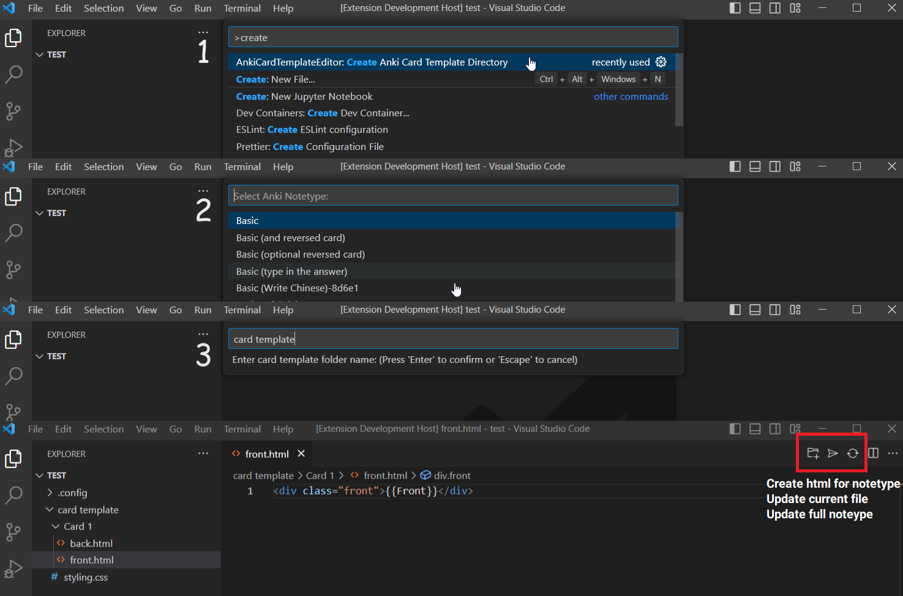
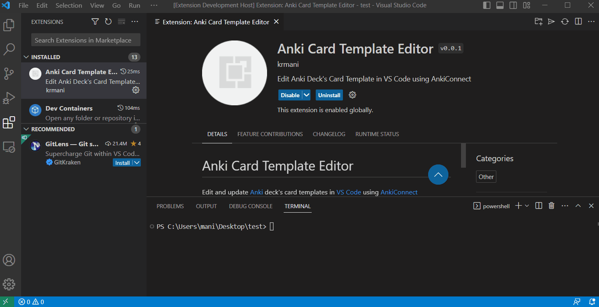

# Anki Card Template Editor

Edit and update [Anki](https://apps.ankiweb.net/) deck's card templates in [VS Code](https://code.visualstudio.com/) using [AnkiConnect](https://github.com/FooSoft/anki-connect)

## Requirements

- [Anki](https://apps.ankiweb.net/)
- [AnkiConnect](https://github.com/FooSoft/anki-connect)
- [VS Code](https://code.visualstudio.com/)

## Features

- Select notetype from drop down to create html and styling of card template
- Edit and update front, back and styling of card template
- Option to update single card type or deck notetype
- Backup directory created with original html and css

## Usage

It is recommended to create backup of Anki decks before using this extension.

### Create Card Template Directory
1. Install [anki-card-template-editor](https://marketplace.visualstudio.com/items?itemName=krmani.anki-card-template-editor) extension
2. Create html files for front, back and styling using commands provided in the extension, use `Ctrl + Shift + P` to open command window and type `create`
3. Select `Create Anki Card Template Directory`
4. Select notetype listed in menu
5. Enter directory name to store files in it
6. It will create html files for each card in a notetype

### Update Current File to Card
1. Open file to edit
2. Click `send` icon button to update current file to card in notetype

### Update full notetype 
1. Edit multiple files
2. Click `sync` icon button to update full notetype with each card

## Demo

